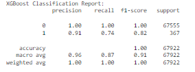

# Capstone_2_Fraud_Detection

# Credit Card Fraud Detection Project

## Introduction
Credit card fraud represents a formidable threat to financial institutions, destabilizing economic structures and eroding consumer trust. As technology progresses, the simplicity of executing transactions has inadvertently widened the scope for increasingly complex fraudulent schemes. In response, there is a heightened imperative to identify and thwart these fraudulent transactions through advanced data science techniques.

This project specifically targets credit card transactions within the western United States—a region notable for its diverse economic activities. A deep understanding of both legitimate and fraudulent transaction patterns in this specific geographical area is vital for developing a robust fraud detection system. By leveraging such insights, our aim is to bolster the security of financial transactions and safeguard consumers from the negative impacts of credit card fraud.

## Project Objectives
The primary objective of this project is to utilize cutting-edge data science and machine learning methodologies to significantly enhance the detection rates of fraudulent activities. We aim to achieve a detection accuracy of at least 95%, thereby contributing effectively to the broader efforts in securing financial ecosystems against fraud.

## Criteria for Success
The benchmark for success in this project is set at achieving a model accuracy of at least 95%. Such a high level of precision will demonstrate our model's capability to accurately discern between fraudulent and legitimate transactions, thereby validating the effectiveness of our approach.

## Scope of the Project
The scope of this project encompasses several key activities, each designed to optimize our model for the highest accuracy in detecting fraudulent transactions. These activities include:

**Data Cleaning** 
-	Handling Missing Values: Addressing gaps in data to ensure a robust dataset for analysis.
-	Outliers: Identifying and managing anomalous entries that could skew results.
-	Dataset Inconsistencies: Rectifying inconsistencies across data entries to maintain uniformity.

**Preprocessing**
-	Feature Engineering: Modifying and creating new features to enhance model performance.
-	Data Compatibility: Adjusting data formats and types for machine learning compatibility.

 **Model Training**
-	Algorithm Implementation: Utilizing algorithms such as logistic regression and decision trees.
-	Cross-Validation: Employing cross-validation techniques to enhance the robustness of the model.

**Evaluation**
-	Performance Metrics: Using precision, recall, and F1-score to assess model performance.
-	Parameter Optimization: Fine-tuning the model to achieve optimal predictive accuracy.

## Data Preparation

### Data Wrangling and Exploratory Data Analysis (EDA)
The data used for this project is a comprehensive simulated dataset of credit card transactions provided by DataCamp, originally derived from a Kaggle dataset. The dataset includes transactions over a two-year period involving 1,000 customers and 800 merchants.

### Data Source
The dataset comprises 339,607 transactions with details on merchant, transaction amounts, purchase categories, and fraud labels. This semi-cleaned dataset serves as a curated foundation for our analysis, emphasizing feature engineering, model development, and tuning.

### Variables Table

 
### Descriptive Statistics and Initial Insights
-	Numerical Columns: Transaction amounts range from $1.00 to $28,948.90, with geographical coordinates also provided.
-	Categorical Columns: Includes transaction timestamps, merchant details, and purchase categories.
-	Fraud Indicators: The dataset marks transactions as fraudulent or legitimate, with a fraud incidence rate of 0.53%.

 
 
### Key Findings from EDA
-	Transaction Patterns: Observations indicate variations in fraud incidence across different times of day, with peaks during late-night hours.
-	Geographical Insights: No significant patterns were identified, highlighting the need for sophisticated feature engineering.
-	Category Analysis: Certain categories like 'Grocery POS' and 'Shopping Net' showed a higher propensity for fraud.
-	Correlation Insights: A notable positive correlation exists between transaction amounts and the occurrence of fraud.
 

## Preprocessing
The preprocessing phase is critical for preparing the dataset for effective machine learning model training. This stage involves various tasks aimed at enhancing the data quality and the predictive power of the model.

### Data Cleaning and Feature Engineering
-	Temporal Features: Including the hour of the transaction and day of the week, as fraudulent transactions may occur at unusual times.
-	Geographical Features: Calculating the Haversine distance between the transaction location and the cardholder's address to detect anomalies.
-	Transaction Amount Features: Identifying high-value transactions and those with rounded amounts, which may signal suspicious activity.

### Feature Encoding
-	One-Hot Encoding: Applied to categorical variables like transaction categories to facilitate their use in linear models.
-	Frequency Encoding: Assigns a frequency value to categories, capturing their prevalence within the dataset.
-	Scaling: Ensures that numerical features have consistent data ranges, which is essential for many machine learning algorithms.

### Feature Selection
After preparing the data, selecting the most relevant features is crucial to optimize the machine learning model's performance. This process helps in reducing overfitting, enhancing model accuracy, and decreasing training time.

### Execution Plan for Feature Selection
-	Initial Feature Importance: Utilizing a Random Forest to assess the relevance of features.
-	Recursive Feature Elimination (RFE): Refining the selection by iteratively removing the least important features.
-	Univariate Selection: Employing statistical tests to select the features with the strongest relationship to the fraud outcome.

  
 
### Selected Features
The final features chosen through the selection process include:

-	Transaction Amount (amt): Directly associated with the transaction.
-	Category Mean Amount (category_mean_amt): Average transaction amount per category.
-	High-Value Transaction Flag (high_value_transaction): Flags transactions significantly higher than a customer's usual pattern.
-	Haversine Distance (distance_km): Measures the geographical anomaly of transactions.
-	Age at Transaction (age_at_transaction): Age of the cardholder at the time of the transaction.
-	Transaction Hour (transaction_hour): Time of the transaction.
-	Category Frequency (category_freq): Frequency of each transaction category.

These features represent a blend of direct transaction details, customer behavior, and derived statistical properties, providing a robust basis for detecting fraudulent activities.

## Model Training
With the dataset prepared and features selected, we move into the model training phase. Several machine learning models are evaluated to determine the most effective in detecting fraudulent transactions.

**Models Considered** 
-	Logistic Regression: Known for its simplicity and efficiency in binary classification tasks.
-	Random Forest: An ensemble method that is highly effective due to its robustness and ability to handle unbalanced datasets.
-	Gradient Boosting: Improves performance through boosting techniques that focus on correcting the predecessor's errors.
-	XGBoost: Stands out for its speed and performance, particularly in structured or tabular datasets.

### Logistic Regression
Starting with the basics, we initiated our modeling with Logistic Regression. Despite its simplicity, this model can serve as a potent baseline due to its expedient training and interpretability:
-	Precision for non-fraudulent transactions (Class 0): Impressively high at 0.99, indicative of the model's proficiency in identifying legitimate transactions.
-	Recall for fraudulent transactions (Class 1): At 0.80, it illustrates a decent ability to detect fraudulent transactions, but there's room for improvement.

 

### Random Forest Classifier
The Random Forest classifier, with its ensemble of decision trees, offers a robust defense against overfitting and shines in its ability to process the dataset's complexity:
-	Precision for Class 1: A substantial 0.95, showcasing the model's high accuracy when predicting fraud.
-	Recall for Class 1: With a score of 0.74, the model demonstrates a strong ability to identify the majority of fraudulent activities.

 
### Gradient Boosting Classifier
The Gradient Boosting model didn't lag far behind, with its focus on reducing errors from previous trees:
-	Recall for Class 1: Lower than desired at 0.40, indicating that while the model is good at predicting non-fraudulent transactions, it might miss several fraudulent instances.

 
### XGBoost Classifier
The XGBoost model emerged as a frontrunner, balancing performance and speed:
-	Recall for Class 1: Achieving a 0.74, it parallels the Random Forest in identifying fraudulent transactions and surpasses it slightly in precision for Class 1.

 

 

## Hyperparameter Tuning and Model Refinement
The pursuit of perfection led us to the realm of hyperparameter tuning. The process is akin to fine-tuning a high-performance engine, ensuring each component operates at its peak.

### Logistic Regression Tuning
The pursuit of the optimal Logistic Regression model brought us to a regularization strength (C) of a staggering 1e+04, and the 'lbfgs' solver stood out as the most efficient algorithm for our dataset, striking a balance between computational efficiency and model performance.

 

### Random Forest Tuning
With the Random Forest, the forest grew denser—settling at 300 trees (estimators) and a max depth of 10. These parameters suggested that the model needed a certain level of complexity to unravel the nuanced patterns hidden in our data.

 

### Gradient Boosting Tuning
The Gradient Boosting model, after tuning, advocated for 200 estimators, a learning rate of 0.1, and a max depth of 7, indicating a preference for steady learning and depth to adequately model the intricacies of the dataset.

 

### XGBoost Tuning
The XGBoost tuning concluded with 200 estimators, a learning rate of 0.1, a max depth of 7, and a full subsample, signaling a model that is robust and eager to learn from the full breadth of data without the risk of overfitting.

With each model fine-tuned to the unique characteristics of our dataset, we witnessed marked improvements across all performance metrics. The models were now equipped not only to distinguish between legitimate and fraudulent transactions but to do so with a newfound level of precision and reliability.

## Utilizing the Best Parameters for Model Refinement
After hyperparameter tuning, we integrated the best parameters back into our models and retrained them. This step is pivotal as it ensures that the models are now primed with settings that are tailored to our specific dataset, leading to enhanced performance.

### 1. Optimized Logistic Regression
Leveraging a strong regularization parameter (C=1e+04) and the 'lbfgs' solver, we saw the model's performance solidify with excellent precision and a better balance in recall:

-	Precision for Class 0: Remained at a stellar 0.99.
-	Recall for Class 1: Slightly improved, indicating a better ability to detect fraudulent transactions after tuning.
-	ROC-AUC Score: Indicated improved discriminatory capacity at 0.827.

 

### 2. Refined Random Forest Classifier
With 300 estimators and a max depth of 10, the Random Forest model's capacity to classify fraudulent transactions was enhanced:
- Precision for Class 1: A very high 0.94.
-	Recall for Class 1: Also improved to 0.70.
-	ROC-AUC Score: An impressive 0.944, highlighting the model's robust predictive capabilities.

 

### 3. Tuned Gradient Boosting Classifier
The Gradient Boosting model, now configured with 200 estimators, a learning rate of 0.1, and a max depth of 7, showed:
-	Precision for Class 1: An excellent 0.93.
-	Recall for Class 1: A notable rise to 0.71.
-	ROC-AUC Score: Reached 0.975, indicating a substantial boost in performance.

 
### 4. Enhanced XGBoost Classifier
The XGBoost model, known for its superior performance, did not disappoint. With its optimized settings, it achieved:
- Precision for Class 1: A high 0.91.
- Recall for Class 1: An impressive 0.76, making it the best performer in fraud detection among the models tested.
- ROC-AUC Score: Peaked at 0.996, underscoring its exceptional classification prowess.

 

## Interpreting the Best Model
The XGBoost model, once fine-tuned, stood out as the leading candidate. To understand the intricacies of its decision-making, we employed model interpretation techniques, extracting valuable insights into the features most influential in predicting fraudulent transactions.

### Permutation Importance
This technique reaffirmed the importance of the transaction amount (amt) and transaction hour as key predictors, indicating the model's sensitivity to transaction size and timing.

 
### Partial Dependence Plots
These plots unveiled the intricate relationship between certain features and the likelihood of fraud. For example, they suggested that as the transaction amount increases, so does the probability of fraud.

 
### SHAP Values
SHAP values provided a granular view of how each feature impacts the model's output, corroborating that features like the transaction amount and hour hold substantial weight in the model's predictions.

## Conclusion
Post-tuning, the models demonstrated a significant leap in predictive accuracy. The meticulous adjustment of hyperparameters, coupled with the comprehensive evaluation metrics and interpretation methods, has furnished us with a potent tool in the fight against credit card fraud. The XGBoost model, in particular, has proven its mettle, achieving outstanding precision and recall, fulfilling our project's ambitious objective, and assuring us of its readiness for deployment in real-world scenarios.

